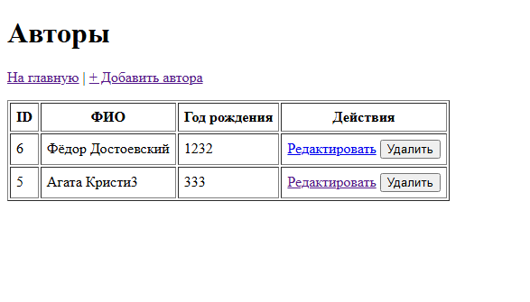
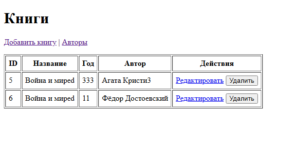

# Практическая работа №2 — Spring MVC приложение (Authors & Books)

**Дисциплина:** Архитектура корпоративных систем  
**Команда:** FSIS (Асташин С.В и Журавлев Н.С.)
**Группа:** 6133-010402D

Небольшое CRUD‑приложение на Spring с трёхслойной архитектурой:

- **Data layer**: Spring Data JPA + Hibernate, PostgreSQL
- **Business layer**: сервисы `AuthorService`, `BookService`
- **Presentation layer**: Spring MVC + Thymeleaf

Предметная область: **Авторы и книги** (таблицы `authors` и `books`).


## Возможности

- Просмотр списка авторов и книг
- Добавление / редактирование / удаление авторов
- Добавление / редактирование / удаление книг
- Связь **Book → Author** (многие‑к‑одному)
- Миграции БД через **Flyway** (создание таблиц + начальные данные)


## Технологии

- Java 17
- Spring Boot
- Spring MVC + Thymeleaf
- Spring Data JPA (Hibernate)
- Flyway
- PostgreSQL
- Maven Wrapper (`mvnw` / `mvnw.cmd`)


## Требования для запуска

1. **JDK 17** установлен и доступен в PATH  
   Проверка:
   ```bash
   java -version
   ```

2. **PostgreSQL** запущен локально (по умолчанию `localhost:5432`)

3. (Опционально) **Git** для загрузки проекта на GitHub


## Настройка базы данных

Создайте базу и пользователя:

```sql
CREATE DATABASE acs_pass;

CREATE USER acs_user WITH PASSWORD 'acs_pass';
GRANT ALL PRIVILEGES ON DATABASE acs_pass TO acs_user;

-- Для PostgreSQL иногда нужно отдельно дать права на схему/таблицы (после миграций):
-- GRANT ALL ON SCHEMA public TO acs_user;
```

> Если уже сделано — просто пропускаем шаг.


## Конфигурация приложения

Файл: `src/main/resources/application.properties`

Пример (как в проекте):

```properties
spring.application.name=acs-pr2-spring-mvc

spring.datasource.url=jdbc:postgresql://localhost:5432/acs_pass
spring.datasource.username=acs_user
spring.datasource.password=acs_pass

spring.jpa.hibernate.ddl-auto=validate
spring.jpa.open-in-view=false

spring.flyway.enabled=true
spring.flyway.locations=classpath:db/migration
```

**Важно:** пароль в учебном проекте можно хранить так, но в “боевом” проекте обычно используют переменные окружения или `application-local.properties`, который не коммитят.


## Миграции Flyway

Миграции лежат здесь:
```
src/main/resources/db/migration
```

При первом запуске Flyway:
- создаст таблицу `flyway_schema_history`
- применит миграции и создаст таблицы `authors`, `books`
- при наличии SQL вставок — добавит стартовые данные


## Запуск проекта

### Вариант A: запустить через Maven Wrapper (самый простой)

**Windows (PowerShell):**
```powershell
.\mvnw.cmd spring-boot:run
```

**macOS / Linux:**
```bash
./mvnw spring-boot:run
```

После старта откройте в браузере:
- `http://localhost:8080/authors`
- `http://localhost:8080/books`


### Вариант B: собрать JAR и запустить его

Сборка:
```bash
./mvnw clean package
```

Запуск:
```bash
java -jar target/*.jar
```


## Особенности поведения

### Удаление автора, если у него были книги

В проекте настроено так, что **при удалении автора книги остаются в таблице `books`**.

То есть книги не удаляются каскадно, и не возникает ошибка ограничения внешнего ключа.

Как это обычно реализуют:
- `author_id` в `books` допускает `NULL`
- внешний ключ настроен с `ON DELETE SET NULL`
- в JPA связь `@ManyToOne(optional = true)` (и `@JoinColumn(nullable = true)`)


## Частые проблемы и решения

### 1) Flyway: Migration checksum mismatch

Если Вы **изменили уже применённый файл миграции**, Flyway ругнётся на checksum mismatch.

Как исправить:
- самый учебный вариант: **удалить БД и создать заново**, затем запустить проект
- либо выполнить `flyway repair` (если понятны последствия)

### 2) Порт 8080 занят
Измените порт в `application.properties`:
```properties
server.port=8081
```

### 3) Не подключается к PostgreSQL
Проверьте:
- PostgreSQL запущен
- правильный порт/хост
- логин/пароль
- база существует

## Скриншоты

### Authors


### Books

