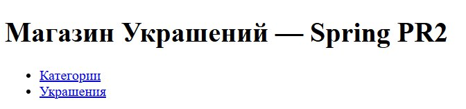
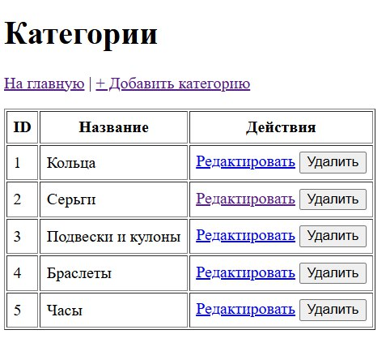
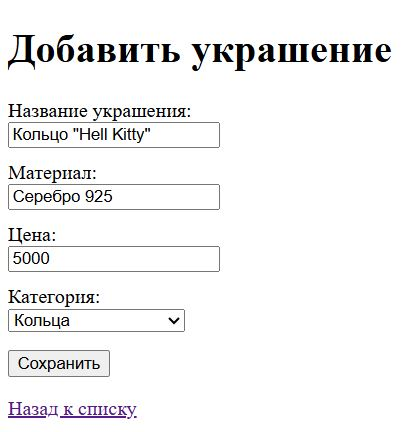
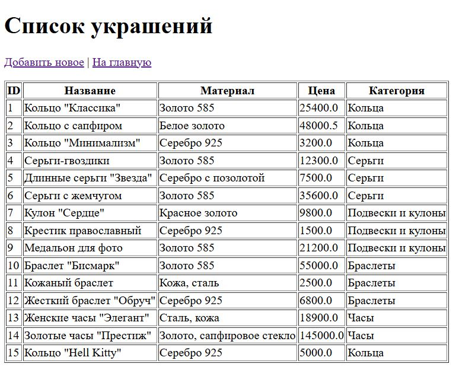

# Практическая работа №2 — Spring MVC приложение (Categories & Jewelry)

**Дисциплина:** Архитектура корпоративных систем  
**Команда:** Толстова Елена и Ищенко Иоанн  
**Группа:** 6132-010402D

Небольшое CRUD‑приложение на Spring с трёхслойной архитектурой:

- **Data layer**: Spring Data JPA + Hibernate, PostgreSQL
- **Business layer**: сервисы `CategoryService`, `JewelryService`
- **Presentation layer**: Spring MVC + Thymeleaf

Предметная область: **Категории и украшения** (таблицы `categories` и `jewelry`).

## Возможности

- Просмотр списка категорий и украшений
- Добавление / редактирование / удаление категорий
- Добавление / редактирование / удаление украшений
- Связь **Jewelry → Category** (многие‑к‑одному)
- Миграции БД через **Flyway** (создание таблиц + начальные данные)

## Технологии

- Java 17
- Spring Boot
- Spring MVC + Thymeleaf
- Spring Data JPA (Hibernate)
- Flyway
- PostgreSQL
- Maven Wrapper (`mvnw` / `mvnw.cmd`)

## Требования для запуска

1. **JDK 17** установлен и доступен в PATH  
   Проверка:
   ```bash
   java -version
   ```

2. **PostgreSQL** запущен локально (по умолчанию `localhost:5432`)

3. (Опционально) **Git** для загрузки проекта на GitHub

## Настройка базы данных

Создайте базу и пользователя:

```sql
CREATE DATABASE jewelry_store;

-- Создайте пользователя (опционально)
CREATE USER jewelry_user WITH PASSWORD 'jewelry_pass';
GRANT ALL PRIVILEGES ON DATABASE jewelry_store TO jewelry_user;

-- Или используйте стандартного пользователя postgres
```

> Если уже сделано — просто пропускаем шаг.

## Конфигурация приложения

Файл: `src/main/resources/application.properties`

Пример (как в проекте):

```properties
spring.application.name=jewelry-store

spring.datasource.url=jdbc:postgresql://localhost:5432/jewelry_store
spring.datasource.username=postgres
spring.datasource.password=1204fghtkm

spring.jpa.hibernate.ddl-auto=validate
spring.jpa.open-in-view=false

spring.flyway.enabled=true
spring.flyway.locations=classpath:db/migration
```

**Важно:** пароль в учебном проекте можно хранить так, но в “боевом” проекте обычно используют переменные окружения или `application-local.properties`, который не коммитят.

## Запуск проекта

### Вариант A: запустить через Maven Wrapper (самый простой)

**Windows (PowerShell):**
```powershell
.\mvnw.cmd spring-boot:run
```

**macOS / Linux:**
```bash
./mvnw spring-boot:run
```

После старта откройте в браузере:
- `http://localhost:8080/categories`
- `http://localhost:8080/jewelry`


### Вариант B: собрать JAR и запустить его

Сборка:
```bash
./mvnw clean package
```

Запуск:
```bash
java -jar target/*.jar
```

## Особенности поведения

### Удаление категории, если у неё были украшения

В проекте настроено так, что при удалении категории украшения остаются в таблице jewelry..

То есть украшения не удаляются каскадно, и не возникает ошибка ограничения внешнего ключа.

Как это реализовано:
- `category_id` в `jewelry` допускает `NULL`
- внешний ключ настроен с `ON DELETE SET NULL`
- в JPA связь `@ManyToOne(optional = true)` (и `@JoinColumn(nullable = true)`)

## Частые проблемы и решения

### 1) Flyway: Migration checksum mismatch

Если Вы **изменили уже применённый файл миграции**, Flyway ругнётся на checksum mismatch.

Как исправить:
- самый учебный вариант: **удалить БД и создать заново**, затем запустить проект
- либо выполнить `flyway repair` (если понятны последствия)

### 2) Порт 8080 занят
Измените порт в `application.properties`:
```properties
server.port=8081
```

### 3) Не подключается к PostgreSQL
Проверьте:
- PostgreSQL запущен
- правильный порт/хост
- логин/пароль
- база существует

## Скриншоты

### Главная страница


### Категории


### Украшения


### Создание украшения


### Проверка созданного украшения



