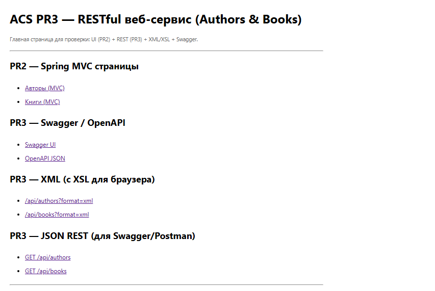
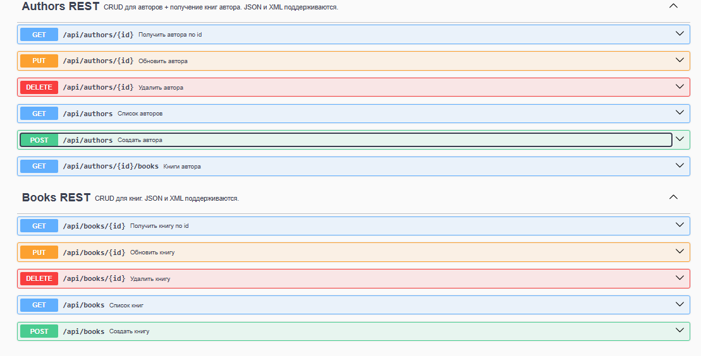
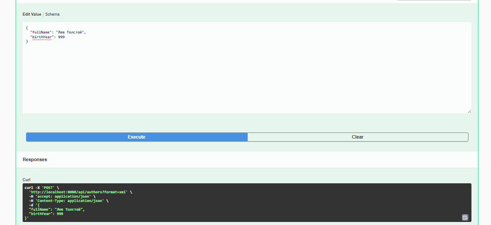

# ACS PR3 — RESTful веб‑сервис (Категории и украшения)

**Дисциплина:** Архитектура корпоративных систем  
**Команда:** Толстова Елена и Ищенко Иоанн  
**Группа:** 6132-010402D

Этот репозиторий содержит **Практическую работу №3**: REST API для управления категориями и украшениями (продолжение приложения из **ПР2**).  
Приложение предоставляет CRUD-операции, поддерживает **JSON и XML**, а для XML добавлено **XSL‑преобразование** для отображения в браузере как HTML‑страниц.  
Также подключена документация **Swagger / OpenAPI**.

---

## Задание 1 — JAX‑RS vs Spring REST

Для PR3 мы выбрали продолжение Spring-проекта, так как он уже содержит полностью настроенную архитектуру (data/service/web), интеграцию с БД через Spring Data JPA, Flyway-миграции, валидацию и удобный запуск через Spring Boot. Это позволяет сосредоточиться на требованиях PR3 (REST API + поддержка JSON/XML + XSLT), а не на инфраструктурной настройке.

Внутри Spring-проекта для реализации REST выбран Spring REST (`@RestController`), а не JAX-RS, потому что он обеспечивает единый стек технологий, минимальную сложность и единую конфигурацию через MessageConverters.

## Задание 2 — выбор предыдущего приложения и проектирование REST API

В качестве базы выбрано приложение из **Практической работы №2** с сущностями:

- **Category**: `id`, `name`
- **Jewelry**: `id`, `title`, `material`, `price`, `category_id`

На его основе спроектировано REST API с операциями:

- Получение списков и отдельных объектов
- Создание
- Обновление
- Удаление

Дополнительно:

- `GET /api/categories/{id}/jewelry` — украшения определённой категории.

---

## Функциональность

### PR2 (MVC страницы)
- `/categories` — список/создание/редактирование/удаление категорий
- `/jewelry` — список/создание/редактирование/удаление украшений

### PR3 (REST)
- REST CRUD для Categories и Jewelry
- Поддержка JSON и XML на вход/выход
- XSL-преобразование: при запросе XML добавляется `<?xml-stylesheet ...?>` для отображения в браузере как HTML
- Swagger UI для работы с API через браузер

### Особенность удаления категории
При удалении категории в таблице `jewelry` поле `category_id` становится `NULL` (**ON DELETE SET NULL**).  
Это позволяет сохранять записи об украшениях даже при удалении их категории.

---

## REST API (эндпоинты)

### Categories
| Метод | URL | Описание |
|-------|-----|----------|
| `GET` | `/api/categories` | Список категорий |
| `GET` | `/api/categories/{id}` | Получение категории по ID |
| `POST` | `/api/categories` | Создание категории |
| `PUT` | `/api/categories/{id}` | Обновление категории |
| `DELETE` | `/api/categories/{id}` | Удаление категории |
| `GET` | `/api/categories/{id}/jewelry` | Украшения определённой категории |

### Jewelry
| Метод | URL | Описание |
|-------|-----|----------|
| `GET` | `/api/jewelry` | Список украшений |
| `GET` | `/api/jewelry/{id}` | Получение украшения по ID |
| `POST` | `/api/jewelry` | Создание украшения |
| `PUT` | `/api/jewelry/{id}` | Обновление украшения |
| `DELETE` | `/api/jewelry/{id}` | Удаление украшения |

---

## JSON и XML

Проект поддерживает оба формата.

### 1) Через query‑параметр (удобно для браузера)
- `?format=xml` → возвращается XML (с добавлением XSL для HTML-отображения)

**Примеры:**

http://localhost:8080/api/categories?format=xml

http://localhost:8080/api/jewelry?format=xml


### 2) Через заголовок Accept (для Postman/curl/клиентов)
- `Accept: application/json`
- `Accept: application/xml`

---

## XSL для XML в браузере

Для отображения XML как HTML в браузере:

1. XSL-файлы находятся в статике:
   - `src/main/resources/static/xsl/categories.xsl`
   - `src/main/resources/static/xsl/category.xsl`
   - `src/main/resources/static/xsl/jewelry-list.xsl`
   - `src/main/resources/static/xsl/jewelry.xsl`

2. При XML‑ответе сервис добавляет инструкцию:
   ```xml
   <?xml-stylesheet type="text/xsl" href="/xsl/....xsl"?>

Можно просто открыть в браузере:
- `http://localhost:8080/api/categories?format=xml`
- `http://localhost:8080/api/jewelry?format=xml`

---

## Swagger / OpenAPI

- Swagger UI: `http://localhost:8080/swagger-ui.html`
- OpenAPI JSON: `http://localhost:8080/v3/api-docs`


---

## Запуск проекта

### Требования
- **Java 17+** (или та версия, которая указана в проекте)
- **Maven 3.9+** (или используйте `mvnw`)
- **PostgreSQL** (локально или в Docker)

### 1) Настройка базы данных
Создайте БД (пример):
- database: `jewelry_store`
- user: `postgres`
- password: `1204fghtkm`

Проверьте настройки в:
- `src/main/resources/application.properties`

Пример (подставьте свои значения):
```properties
spring.datasource.url=jdbc:postgresql://localhost:5432/jewelry_store
spring.datasource.username=postgres
spring.datasource.password=120fghtkm

spring.jpa.hibernate.ddl-auto=validate
spring.jpa.open-in-view=false

spring.flyway.enabled=true
```

### 2) Запуск
Из корня проекта:

```bash
./mvnw spring-boot:run
```

Или собрать jar:
```bash
./mvnw clean package
java -jar target/*.jar
```

После запуска:
- Главная страница: `http://localhost:8080/`
- MVC: `/categories`, `/jewelry`
- REST: `/api/...`
- Swagger: `/swagger-ui.html`

- ## Примеры запросов

### PowerShell (важно!)
В PowerShell `curl` часто является алиасом `Invoke-WebRequest`, поэтому команды в стиле Linux могут «ломаться».


# Создание категории
curl.exe -X POST "http://localhost:8080/api/categories" `
  -H "Content-Type: application/json" `
  -H "Accept: application/json" `
  -d "{\"name\":\"Новая категория\"}"

# Создание украшения
curl.exe -X POST "http://localhost:8080/api/jewelry" `
  -H "Content-Type: application/json" `
  -H "Accept: application/json" `
  -d "{\"title\":\"Кольцо новое\",\"material\":\"Серебро\",\"price\":5000,\"categoryId\":1}"


### Получить XML (для браузера)

http://localhost:8080/api/categories?format=xml\

http://localhost:8080/api/jewelry?format=xml

## Скриншоты

### Главная страница


### XML Categories (с XSL)


### XML Jewelry (с XSL)


### Swagger UI



### Swagger UI (пример POST запроса)


