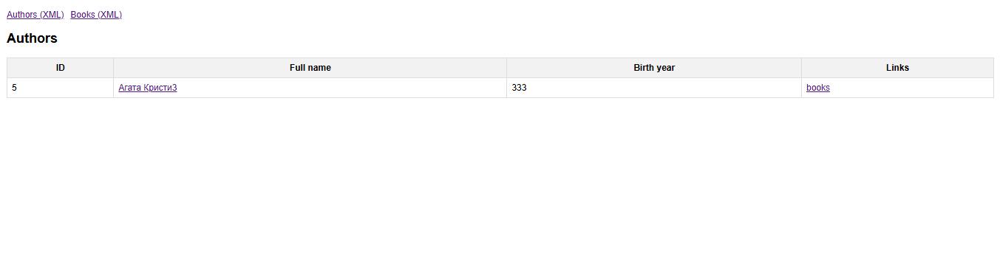
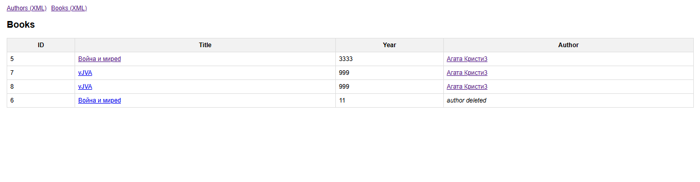

# ACS PR3 — RESTful веб‑сервис (Authors & Books)

**Дисциплина:** Архитектура корпоративных систем  

**Команда:** FSIS (Асташин С.В и Журавлев Н.С.)

**Группа:** 6133-010402D

Предметная область: **Авторы и книги** (таблицы `authors` и `books`).

Этот репозиторий содержит **Практическую работу №3**: REST API для модели *Authors–Books* (продолжение приложения из **ПР2**).  
Приложение предоставляет CRUD для сущностей, поддерживает **JSON и XML**, а для XML добавлено **XSL‑преобразование**, чтобы браузер показывал XML как HTML‑страницы.  
Также подключена документация **Swagger / OpenAPI**.

---

## Задание 1 — JAX‑RS vs Spring REST

Для PR3 я мог продолжить любой из двух прошлых проектов: приложение на JakartaEE или приложение на Spring. Я сознательно выбрал продолжать Spring-проект, потому что он уже содержит полностью настроенную типовую архитектуру (data/service/web), интеграцию с БД через Spring Data JPA, Flyway-миграции, валидацию (Jakarta Validation) и удобный запуск через Spring Boot. Это позволяет сосредоточиться именно на требованиях PR3 (REST API + поддержка JSON/XML + XSLT для XML), а не тратить время на дополнительную инфраструктурную настройку и “ручную” сборку окружения, которая обычно больше требуется в JakartaEE-варианте.

Внутри выбранного Spring-проекта для реализации REST я выбрал Spring REST (@RestController, Spring Web), а не JAX-RS, потому что Spring REST в данном приложении даёт единый стек и минимальную сложность: те же механизмы DI, те же сервисы и репозитории, единая обработка ошибок/валидации и единая конфигурация контента (application/json, application/xml) через MessageConverters. Подключение JAX-RS внутри Spring-проекта потребовало бы отдельного JAX-RS runtime (например, Jersey/RESTEasy) и дополнительной конфигурации маршрутизации и сериализации, что усложняет проект без преимущества для требований работы. Поэтому оптимальный и наиболее “чистый” выбор для этого варианта — Spring REST.

## Задание 2 — выбор предыдущего приложения и проектирование REST API

В качестве базы выбрано приложение из **Практической работы №2**:

- **Author**: `id`, `fullName`, `birthYear`
- **Book**: `id`, `title`, `publishedYear`, `authorId`

На его основе спроектировано REST API, которое предоставляет операции:
- Получение списков и отдельных объектов
- Создание
- Обновление
- Удаление

Дополнительно:
- `GET /api/authors/{id}/books` — книги конкретного автора.

---

## Функциональность (что умеет проект)

### PR2 (MVC страницы)
- `/authors` — список/создание/редактирование/удаление авторов
- `/books` — список/создание/редактирование/удаление книг

### PR3 (REST)
- REST CRUD для Authors и Books
- JSON и XML на вход/выход
- XSL преобразование: при запросе XML добавляется `<?xml-stylesheet ...?>`, чтобы браузер отображал как HTML
- Swagger UI для удобной работы с API через браузер

### Важная особенность (удаление автора)
Книги **не удаляются**, даже если удаляется автор.  
При удалении автора в таблице `books` поле `author_id` становится `NULL` (**ON DELETE SET NULL**).  
Это позволяет сохранять записи о книгах.

---

## REST API (эндпоинты)

### Authors
- `GET  /api/authors` — список авторов  
- `GET  /api/authors/{id}` — автор по id  
- `POST /api/authors` — создать автора  
- `PUT  /api/authors/{id}` — обновить автора  
- `DELETE /api/authors/{id}` — удалить автора  
- `GET /api/authors/{id}/books` — книги автора  

### Books
- `GET  /api/books` — список книг  
- `GET  /api/books/{id}` — книга по id  
- `POST /api/books` — создать книгу  
- `PUT  /api/books/{id}` — обновить книгу  
- `DELETE /api/books/{id}` — удалить книгу  

---

## JSON и XML (как выбирать формат)

Проект поддерживает **оба формата**.

### 1) Через query‑параметр (удобно для браузера)
- `?format=xml` → отдаётся XML (и добавляется XSL PI для красивого HTML в браузере)

Пример:
- `http://localhost:8080/api/authors?format=xml`
- `http://localhost:8080/api/books?format=xml`

### 2) Через заголовок Accept (для Postman/curl/клиентов)
- `Accept: application/json`
- `Accept: application/xml`

---

## XSL для XML в браузере

Чтобы браузер показывал XML как HTML:
1. XSL-файлы лежат в статике:
   - `src/main/resources/static/xsl/authors.xsl`
   - `src/main/resources/static/xsl/author.xsl`
   - `src/main/resources/static/xsl/books.xsl`
   - `src/main/resources/static/xsl/book.xsl`
2. При XML‑ответе сервис добавляет в начало:
   - `<?xml-stylesheet type="text/xsl" href="/xsl/....xsl"?>`

Можно просто открыть в браузере:
- `http://localhost:8080/api/authors?format=xml`
- `http://localhost:8080/api/books?format=xml`

---

## Swagger / OpenAPI

- Swagger UI: `http://localhost:8080/swagger-ui.html`
- OpenAPI JSON: `http://localhost:8080/v3/api-docs`


---

## Запуск проекта

### Требования
- **Java 17+** (или та версия, которая указана в проекте)
- **Maven 3.9+** (или используйте `mvnw`)
- **PostgreSQL** (локально или в Docker)

### 1) Настройка базы данных
Создайте БД (пример):
- database: `acs_pass`
- user: `acs_user`
- password: `acs_pass`

Проверьте настройки в:
- `src/main/resources/application.properties`

Пример (подставьте свои значения):
```properties
spring.datasource.url=jdbc:postgresql://localhost:5432/acs_pass
spring.datasource.username=acs_user
spring.datasource.password=acs_pass

spring.jpa.hibernate.ddl-auto=validate
spring.jpa.open-in-view=false

spring.flyway.enabled=true
```

### 2) Запуск
Из корня проекта:

```bash
./mvnw spring-boot:run
```

Или собрать jar:
```bash
./mvnw clean package
java -jar target/*.jar
```

После запуска:
- Главная страница: `http://localhost:8080/`
- MVC: `/authors`, `/books`
- REST: `/api/...`
- Swagger: `/swagger-ui.html`

---

## Примеры запросов

### PowerShell (важно!)
В PowerShell `curl` часто является алиасом `Invoke-WebRequest`, поэтому команды в стиле Linux могут «ломаться».

**Вариант A (рекомендуется): `curl.exe`**
```powershell
curl.exe -X POST "http://localhost:8080/api/authors" `
  -H "Content-Type: application/json" `
  -H "Accept: application/json" `
  -d "{\"fullName\":\"Лев Толстой\",\"birthYear\":1828}"
```

**Вариант B: Invoke-RestMethod**
```powershell
Invoke-RestMethod -Method Post -Uri "http://localhost:8080/api/authors" `
  -Headers @{ "Content-Type"="application/json"; "Accept"="application/json" } `
  -Body '{ "fullName":"Лев Толстой", "birthYear":1828 }'
```

### Создать книгу (JSON)
```powershell
curl.exe -X POST "http://localhost:8080/api/books" `
  -H "Content-Type: application/json" `
  -H "Accept: application/json" `
  -d "{\"title\":\"Война и мир\",\"publishedYear\":1869,\"authorId\":1}"
```

### Получить XML (для браузера)
- `http://localhost:8080/api/authors?format=xml`
- `http://localhost:8080/api/books?format=xml`

---

## Скриншоты

### Главная страница


### XML Authors (c XSL)


### XML Books (c XSL)


### Swagger UI


### Swagger UI (пример POST запроса)


