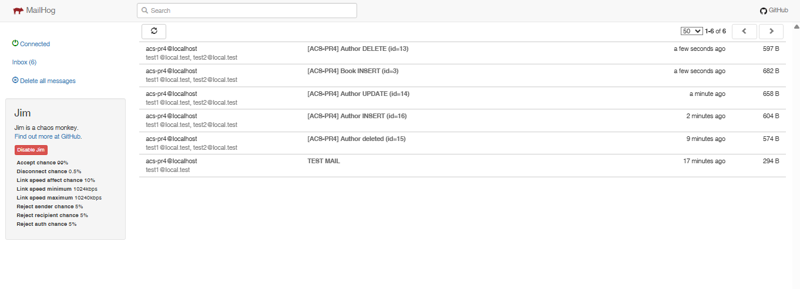

# ACS PR4 — Java Message Service

**Дисциплина:** Архитектура корпоративных систем  

**Команда:** FSIS (Асташин С.В и Журавлев Н.С.)

**Группа:** 6133-010402D


Практическая работа №4: добавлен механизм журналирования изменений (audit_log) и система оповещений по email через JMS.

## Стек
- Java 17
- Spring Boot
- Spring Data JPA + Hibernate
- Flyway
- PostgreSQL
- JMS: ActiveMQ Artemis
- Email: MailHog (SMTP)
- Swagger/OpenAPI

---

## 1) Предварительные требования

### Установить/иметь:
- Java 17
- Maven
- PostgreSQL (локально)
- (опционально) Docker — если запускаете Artemis/MailHog через Docker

---

## 2) Настройка базы данных

Создайте БД и пользователя (пример):
```sql
CREATE DATABASE acs_pass;
CREATE USER acs_user WITH PASSWORD 'acs_pass';
GRANT ALL PRIVILEGES ON DATABASE acs_pass TO acs_user;
````

В `application.properties` должны быть корректные данные подключения:

```properties
spring.datasource.url=jdbc:postgresql://localhost:5432/acs_pass
spring.datasource.username=acs_user
spring.datasource.password=acs_pass
```

Flyway при запуске сам создаст таблицы, включая `audit_log`.

---

## 3) Запуск ActiveMQ Artemis и MailHog

### Вариант A (рекомендуется): запуск через Docker (как у меня)

#### 3.1 Запуск Artemis

```bash
docker run -d --name artemis \
  -p 61616:61616 -p 8161:8161 \
  -e ARTEMIS_USER=admin -e ARTEMIS_PASSWORD=admin \
  apache/activemq-artemis:2.41.0-alpine
```

Панель Artemis: [http://localhost:8161](http://localhost:8161)
Логин/пароль: `admin / admin`

#### 3.2 Запуск MailHog

```bash
docker run -d --name mailhog \
  -p 1025:1025 -p 8025:8025 \
  mailhog/mailhog
```

Панель MailHog: [http://localhost:8025](http://localhost:8025)

---

### Вариант B: запуск без Docker (локально)

#### 3.1 ActiveMQ Artemis без Docker

1. Скачайте ActiveMQ Artemis с официального сайта (дистрибутив).
2. Создайте брокер:

```bash
./artemis create mybroker
```

3. Запустите:

```bash
cd mybroker/bin
./artemis run
```

4. Убедитесь, что порты:

* 61616 (JMS)
* 8161 (web console)

#### 3.2 MailHog без Docker

1. Скачайте MailHog (бинарник под вашу ОС) из релизов.
2. Запуск:

```bash
MailHog
```

3. Порты по умолчанию:

* SMTP: 1025
* Web UI: 8025

---

## 4) Настройки приложения

Пример `src/main/resources/application.properties` (ключевые параметры):

```properties
# DB
spring.datasource.url=jdbc:postgresql://localhost:5432/acs_pass
spring.datasource.username=acs_user
spring.datasource.password=acs_pass

spring.jpa.hibernate.ddl-auto=validate
spring.jpa.open-in-view=false

spring.flyway.enabled=true
spring.flyway.locations=classpath:db/migration

# JMS (Artemis)
spring.artemis.mode=native
spring.artemis.broker-url=tcp://localhost:61616
spring.artemis.user=admin
spring.artemis.password=admin

app.jms.audit-queue=audit.queue
app.jms.notify-queue=notify.queue

# Email (MailHog)
spring.mail.host=localhost
spring.mail.port=1025
spring.mail.properties.mail.smtp.auth=false
spring.mail.properties.mail.smtp.starttls.enable=false

app.notify.enabled=true
app.notify.from=acs-pr4@localhost
app.notify.to=test1@local.test,test2@local.test
app.notify.subject-prefix=[ACS-PR4]
```

> Важно: если приложение запускается НЕ внутри docker-сети (обычно так и есть), то `spring.mail.host=localhost`.
> Если бы приложение было контейнером внутри compose-сети — тогда было бы `mailhog`.

---

## 5) Запуск приложения

В корне проекта:

```bash
mvn clean spring-boot:run
```

Swagger UI:

* [http://localhost:8080/swagger-ui.html](http://localhost:8080/swagger-ui.html)

---

## 6) Проверка работоспособности лабораторной (пошагово)

### 6.1 Проверка CRUD и генерации событий

Через Swagger или curl:

#### INSERT (создание автора)

* POST `/api/authors`

```json
{
  "fullName": "Иван Иванов",
  "birthYear": 1990
}
```

Ожидаем:

* сообщение улетело в JMS очереди `audit.queue` и `notify.queue`
* запись появилась в `audit_log`
* письмо появилось в MailHog

#### UPDATE

* PUT `/api/authors/{id}`

```json
{
  "fullName": "Иван Иванович",
  "birthYear": 1991
}
```

Ожидаем то же самое.

#### DELETE

* DELETE `/api/authors/{id}`
  Ожидаем то же самое.

---

### 6.2 Проверка таблицы audit_log (PostgreSQL)

Пример запроса:

```sql
SELECT id, occurred_at, action, entity_type, entity_id, summary, before_data, after_data
FROM audit_log
ORDER BY occurred_at DESC;
```

В таблице должны появляться строки после INSERT/UPDATE/DELETE.

* Скриншот 1: таблица `audit_log` с несколькими событиями (INSERT/UPDATE/DELETE)


---

### 6.3 Проверка Artemis (сообщения в очередях)

Открыть Artemis Console: [http://localhost:8161](http://localhost:8161)
Вкладка `Queues`:

* `audit.queue`
* `notify.queue`

Должно быть видно увеличение счетчиков сообщений / доставку.


* Скриншот 2: Artemis → Queues, видно что сообщения добавляются в `audit.queue` и `notify.queue`


---

### 6.4 Проверка MailHog (письма)

Открыть MailHog UI: [http://localhost:8025](http://localhost:8025)

Должны появляться письма при любом изменении (INSERT/UPDATE/DELETE).


* Скриншот 3: MailHog Inbox, видно пришедшее письмо




---

## 7) Полезные ссылки

* Swagger: [http://localhost:8080/swagger-ui.html](http://localhost:8080/swagger-ui.html)
* Artemis Console: [http://localhost:8161](http://localhost:8161)
* MailHog UI: [http://localhost:8025](http://localhost:8025)


